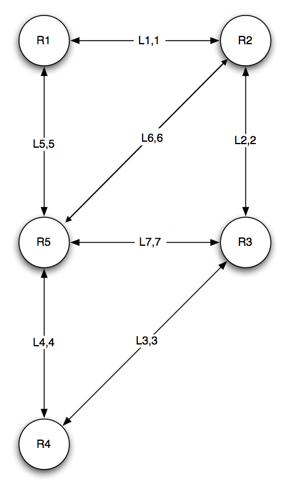

Open Shortest Path Routing
==========================

About
-----

This program contains a java implemententation for the Open Shortest Path First routing algorithm (OSPF). 
*For more information on link-state routing algorithms see https://searchnetworking.techtarget.com/definition/OSPF-Open-Shortest-Path-First*

To achieve this, our individual 5 router programs will conect to a provided Network State Emulator (NSE) program with the following hardcoded 5-router circuit database:

Compiling and Setup
-------------------

The emulator is an executable file which should be run before the individual router programs. When running the emulator, pass the host address on which the router programs are running as well as a port number to communicate on.

*E.g. ./nEmulator-linux386 <router_host_address> <emulator_port>* 

The router application can be compiled via the 'make' command. To start the application run the java program while passing the router id, emulator host address, emulator port number and router port.

*E.g. java Router <router_id> <emulator_host> <emulator_port> <router_port>*

Example Execution
-----------------

1.  

Compiling and Setup
-------------------

The emulator is an executable file which should be run before both sender and receiver programs. When running the emulator, pass the emulator send port, receiver host, receiver port, emulator recieve port, sender host, sender port, max delay (ms), discard probability [0-1], and verbose mode flag as command line parameters in that order.

*E.g. ./nEmulator-linux386 <emulator_send_port> <receiver_host> <receiver_port> <emulator_receive_port> <sender_host> <sender_port> <max_delay> <discard_probability> <verbose_mode_flag>* 

The sender and receiver applications can both be compiled via the 'make' command. 

To start the sender program, run the sender program passing the emulator address, emulator send port, sender port and input file as command line parameters.

*E.g. java Sender <emulator_host> <emulator_sender_port> <sender_port> <input_file>*
  
To start the receiver application, run the receiver program passing the emulator address, emulator receive port, receiver port and output file as command line parameters.

*E.g. java Receiver <emulator_host> <emulator_receive_port> <receiver_port> <output_file>*

**- Make sure to start the receiver before starting the sender**

Example Execution
-----------------

1. ./nEmulator-linux386 9991 127.94.48.56 9994 9993 127.43.45.754 9992 1 0.2 1
2. java Receiver 127.59.09.342 9993 9994 output.txt
3. java Sender 127.59.09.342 9991 9992 input.txt

Program Flow
------------

1. Sender will read in the input file and break it down into a list of packets (byte arrays)

2. Sender will begin sending packets to the emulator up until window size has been reached

3. Receiver will receive packets and write packets with correct sequence number to the output file

4. Receiver will drop unwanted packets and always send a cumulative acknolwedgement back to sender *(Go-Back-N)*

5. Sender will retransmit any packets for which timer expires or if wrong ACK has been received

6. Once all packets successfully transmitted, sender will send an EOT packet

7. Receiver will send an EOT acknowledgement back to sender

8. Sender will write all packets sent and acks recieved to log files *seqnum.log* & *ack.log* respectively and exit

9. Receiver will write all packet sequence numbers it received to *arrival.log* and exit

